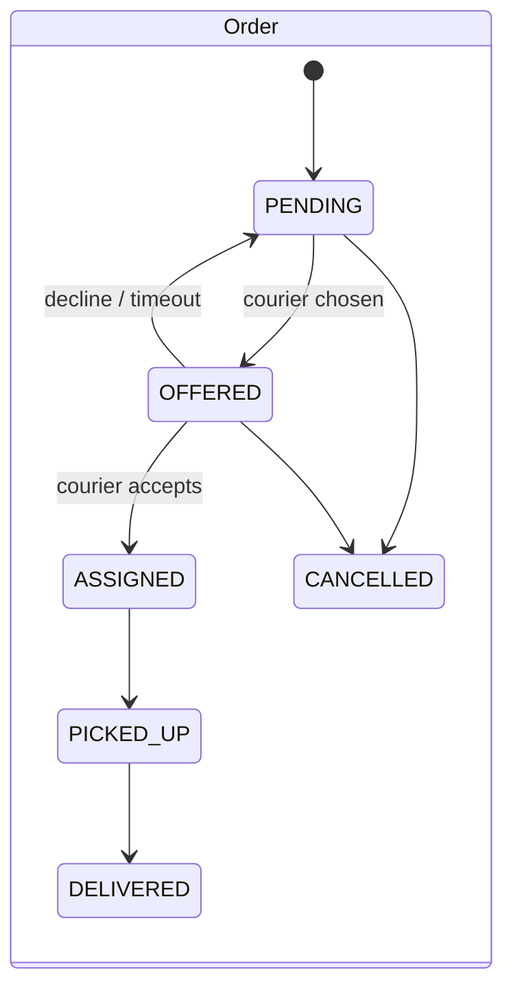
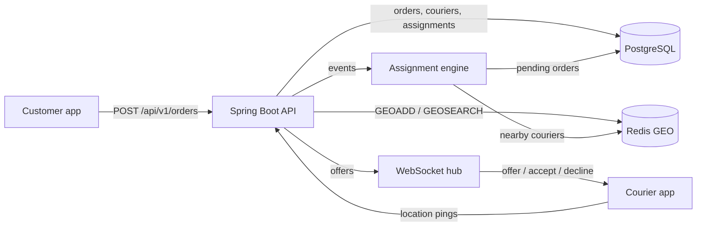

# Dispatch: design

Dispatch is a backend that matches delivery orders to couriers in real time. A customer order comes in, the system
finds the best available courier nearby, offers the order to that courier over a WebSocket, and reassigns it if the
courier declines or doesn't answer in time.

This document is the plan the code follows. Sections marked *(D2+)* describe parts that later milestones build.

## Goals and non-goals

Goals:

- Assign each order to a courier within a few hundred milliseconds of it becoming assignable.
- Never assign one courier two active orders, and never give one order two active couriers, even under concurrency.
- Order creation is idempotent: a client that retries a request with the same idempotency key gets the same order.
- Every decision is explainable: the rule is deterministic, and the inputs (distance, wait time, tier) are stored.

Non-goals: routing along real roads (we use straight-line distance), batching several orders onto one courier,
pricing, and customer-facing tracking.

## Domain

| Concept | What it is | Where it lives |
|---|---|---|
| **Zone** | A service area: a centre point and a radius (e.g. "Boston Back Bay", 3 km). Orders and couriers belong to one zone; matching never crosses zones. | Postgres `zones` |
| **Courier** | A person who delivers. Has a status: `OFFLINE`, `AVAILABLE`, `OFFERED` (an offer is pending), `BUSY` (carrying an order). | Postgres `couriers` (record), Redis (live position) |
| **Order** | A pickup and drop-off location, a tier (`STANDARD` or `PRIORITY`), and a status: `PENDING` → `OFFERED` → `ASSIGNED` → `PICKED_UP` → `DELIVERED`, or `CANCELLED`. | Postgres `orders` |
| **Assignment** | One offer of one order to one courier, with its outcome: `OFFERED` → `ACCEPTED`, `DECLINED` or `EXPIRED`, and an accepted one ends `COMPLETED` (delivered) or `CANCELLED`. An order can have many assignments over its life (one per attempt) but only one active one. | Postgres `assignments` |

### State machines



A courier moves `AVAILABLE` → `OFFERED` when an order is offered, back to `AVAILABLE` on decline or timeout, to
`BUSY` on accept, and back to `AVAILABLE` on delivery. `OFFLINE` couriers are never candidates.

## The assignment rule

Two questions: **which order goes next**, and **which courier gets it**.

### 1. Which order goes next: the order priority score

Pending orders in a zone are served highest score first:

```
priority(order, now) = tierBonus(order.tier) + minutesWaiting(order, now)

tierBonus(STANDARD) = 0
tierBonus(PRIORITY) = 10
```

So a `PRIORITY` order is treated as if it had already waited 10 extra minutes. Because waiting time keeps growing, a
standard order can never be starved: after 10 minutes it outranks any newly created priority order. Ties go to the
older order, then to the smaller order id, so the order is total and deterministic.

### 2. Which courier gets it: nearest available, with tie-breaks

For the chosen order, candidates are couriers that are `AVAILABLE`, in the order's zone, have reported a location
in the last 60 seconds, and are within `maxPickupKm` (default 5 km) of the pickup point. Among candidates:

1. **Nearest first**, by great-circle (haversine) distance from the courier to the pickup.
2. Couriers within **50 m** of the nearest one count as tied with it (GPS noise is larger than that). The tie goes
   to the courier who has been **idle longest**, which spreads work fairly. Couriers past that window start the
   next band, anchored at the nearest of them, and so on; the full ranking is the fallback list if the winner is
   claimed by another order first.
3. A remaining tie goes to the smaller courier id.

If there's no candidate, the order stays `PENDING` and is retried when a courier becomes available or moves.

Why this rule: nearest-courier is what minimises pickup time for the order in hand, which is what customers feel.
It's greedy (it doesn't minimise total distance across all orders the way a bipartite matching would), and that's a
deliberate trade: it's O(candidates) per order, easy to explain, and a global optimiser can be swapped in behind
the same interface later. The fairness tie-break keeps one well-placed courier from taking every order.

The rule lives in pure functions (`PriorityScore`, `CourierRanking`) with no I/O, so it's unit-tested directly.

## Architecture



- **PostgreSQL** is the source of truth for orders, couriers and assignments. Schema changes go through Flyway.
- **Redis GEO** holds live courier positions: one sorted set per zone (`couriers:geo:{zoneId}`), updated on every
  ping with `GEOADD`, queried with `GEOSEARCH ... BYRADIUS ... ASC`. Pings arrive far more often than orders, so
  they never touch Postgres on the hot path. A per-courier key with a TTL (`courier:seen:{id}`) marks freshness.
- **Assignment engine** (`AssignmentEngine`, D2): one *pass* over a zone takes its pending orders highest
  priority first; for each, it asks Redis for couriers with a fresh ping near the pickup, keeps the ones Postgres
  says are `AVAILABLE`, ranks them with `CourierRanking`, and claims the winner in one Postgres transaction. Today
  a pass runs on `POST /api/v1/zones/{id}/dispatch`; from D3, events (order created, courier became available,
  offer expired) trigger passes.
- **WebSocket hub** *(D3)*: pushes offers to the courier's open connection and receives accept/decline.

### Concurrency: how double-assignment is prevented

The database enforces it, not application code alone:

- A partial unique index allows at most one assignment with status `OFFERED` or `ACCEPTED` per order, and another
  allows at most one per courier.
- The engine claims a courier with a conditional update (`UPDATE couriers SET status='OFFERED' WHERE id=? AND
  status='AVAILABLE'`); if it updates zero rows, someone else got the courier first and the engine tries the next
  candidate.
- Order state changes use the same compare-and-set pattern on `status`.

So two engine threads racing for the same courier can't both win, and a bug in the engine fails loudly with a
constraint violation instead of silently double-assigning.

### One engine pass, step by step

1. **Load the batch.** Up to `pending-batch` (200) of the zone's `PENDING` orders, ordered in SQL by
   `created_at - tierBonus`. That's the same order as the priority score (score = bonus + time waited, so a
   larger score means an earlier "effective" creation time), which means the batch can't leave out a newer
   priority order that outranks older standard ones. The engine then re-sorts with `PriorityScore` itself so the
   rule has one definition.
2. **For each order, find candidates.** `GEOSEARCH couriers:geo:{zone} FROMLONLAT … BYRADIUS 5 km ASC`, then one
   `MGET` of the `courier:seen:{id}` markers to drop stale couriers (and remove them from the GEO set), then one
   `SELECT … WHERE status = 'AVAILABLE' AND id = ANY(?)` for status and `idle_since`.
3. **Rank** with `CourierRanking` (nearest, 50 m bands, longest idle, id).
4. **Claim**, in one transaction:
   `UPDATE orders SET status='OFFERED' WHERE id=? AND status='PENDING'` (zero rows: another pass took the order,
   skip it); then down the ranking, `UPDATE couriers SET status='OFFERED' WHERE id=? AND status='AVAILABLE'` until
   one succeeds; then `INSERT INTO assignments`. If every ranked courier was taken meanwhile, roll back, and the
   order stays `PENDING`.

Why this can't deadlock: a claim holds one order row and waits on a courier row only while it holds no courier;
the transaction holding that courier has already finished claiming and doesn't wait on anything. Why it can't
double-assign: both updates are compare-and-sets, and the partial unique indexes back them up.
`ConcurrentDispatchTest` runs eight passes over the same zone at once to check exactly that.

### Idempotent order creation

`POST /api/v1/orders` requires an `Idempotency-Key` header (1–255 printable ASCII characters).
`orders.idempotency_key` is unique, and `orders.request_hash` stores a SHA-256 of a canonical form of the request
(zone, coordinates, tier with the default filled in), so formatting differences don't matter.

| Situation | Response |
|---|---|
| New key | `201 Created`, `Location`, `Idempotent-Replayed: false` |
| Same key, same request | `200 OK` with the original order, `Idempotent-Replayed: true` |
| Same key, different request | `409 Conflict` |
| Unknown zone, or pickup outside the zone's radius | `422 Unprocessable Entity` |
| Missing/invalid key, invalid body | `400 Bad Request` |

The insert is `INSERT … ON CONFLICT (idempotency_key) DO NOTHING RETURNING …`. If it returns no row, a concurrent
request with the same key won the race; the service reads the winner and replays it (or returns 409 if the bodies
differ). So simultaneous retries never surface a unique-violation error. Errors are RFC 9457
`application/problem+json`.

### Couriers: status and location

- Couriers set only `AVAILABLE` and `OFFLINE` themselves (`PUT /couriers/{id}/status`); `OFFERED` and `BUSY` are
  set by the engine (and D3's accept flow). Repeating the current status is a no-op; an `OFFERED` or `BUSY` courier
  can't go offline (409). Each change is a compare-and-set, retried on a lost race. Becoming `AVAILABLE` stamps
  `idle_since`; going `OFFLINE` deletes the Redis position.
- A location ping (`PUT /couriers/{id}/location`) is one pipelined Redis round trip: `GEOADD` plus
  `SET courier:seen:{id} … EX 60`. The courier's zone (needed for the key) is cached in memory after the first
  lookup, since a courier's zone never changes, so steady-state pings don't touch Postgres. `couriers.last_seen_at`
  is therefore not updated per ping; Redis is where freshness lives.

## Schema (Flyway `V1__init.sql`)

- `zones(id, name, center_lat, center_lng, radius_km)`
- `couriers(id, zone_id, name, status, idle_since, last_seen_at, created_at, updated_at)`
- `orders(id, idempotency_key UNIQUE, request_hash, zone_id, pickup/dropoff lat-lng, tier, status, created_at,
  updated_at)`, with a partial index on pending orders per zone
- `assignments(id, order_id, courier_id, status, distance_m, offered_at, responded_at)` with the two partial unique
  indexes above.

Check constraints keep coordinates in range and statuses to the known values.

## API surface

| Method | Path | Milestone |
|---|---|---|
| GET | `/api/v1/health` (and `/actuator/health`) | D1 |
| PUT, GET | `/api/v1/zones/{id}` | D2 |
| POST | `/api/v1/zones/{id}/dispatch` (run one engine pass now) | D2 |
| POST | `/api/v1/orders` (Idempotency-Key header) | D2 |
| GET | `/api/v1/orders/{id}` | D2 |
| POST | `/api/v1/couriers` (register), GET `/api/v1/couriers/{id}` | D2 |
| PUT | `/api/v1/couriers/{id}/location` | D2 |
| PUT | `/api/v1/couriers/{id}/status` | D2 |
| WS | `/ws/couriers/{id}` (offers, accept, decline) | D3 |

## Failure handling *(D3–D4)*

- **Offer timeout:** an offer not answered in 30 s expires; the order goes back to `PENDING` and the courier back
  to `AVAILABLE` (and is skipped for that order).
- **Courier disconnect:** a courier whose location goes stale (no ping for 60 s) drops out of candidates (built in
  D2: the `courier:seen` TTL); a pending offer to a disconnected courier expires normally.
- **Redis loss:** positions are soft state. Couriers resend location every few seconds, so Redis refills itself.

## Measurement plan *(D4)*

A simulator replays 50K synthetic events (orders and location pings) against the API and records assignment
latency (order created → offer sent). Report p50/p95 before and after one optimisation, with the command used.

## Ports

App 8101, Redis 6381, Postgres 14 database `dispatch` on 5432.
