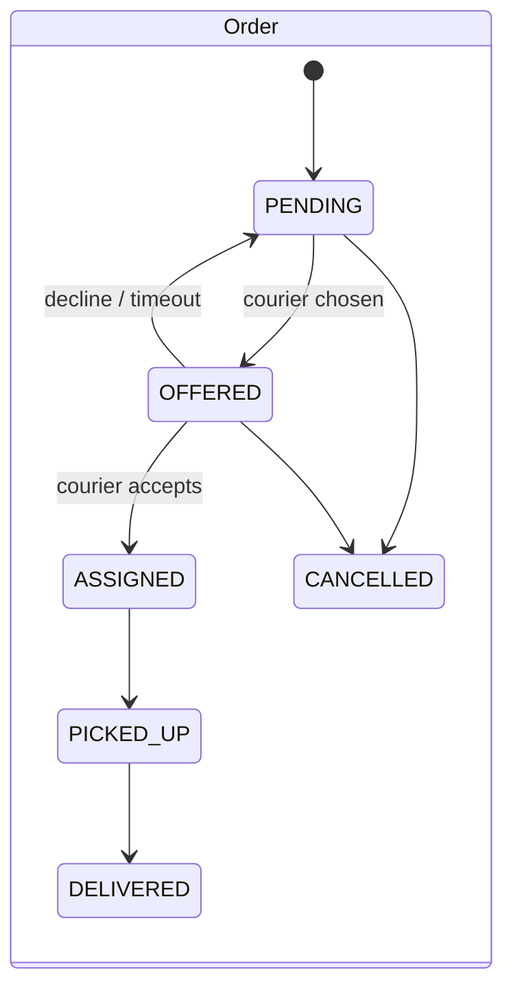
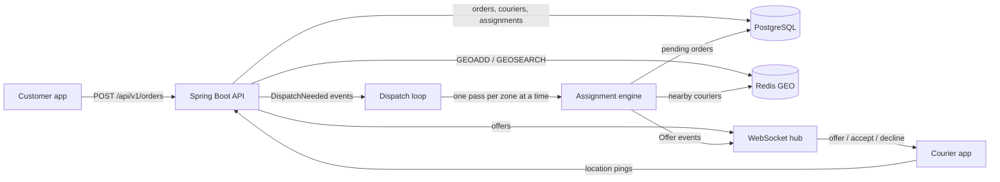

# Dispatch: design

Dispatch is a backend that matches delivery orders to couriers in real time. A customer order comes in, the system
finds the best available courier nearby, offers the order to that courier over a WebSocket, and reassigns it if the
courier declines or doesn't answer in time.

This document is the plan the code follows. Sections marked *(D4)* describe parts a later milestone builds.

## Goals and non-goals

Goals:

- Assign each order to a courier within a few hundred milliseconds of it becoming assignable.
- Never assign one courier two active orders, and never give one order two active couriers, even under concurrency.
- Order creation is idempotent: a client that retries a request with the same idempotency key gets the same order.
- Every decision is explainable: the rule is deterministic, and the inputs (distance, wait time, tier) are stored.

Non-goals: routing along real roads (we use straight-line distance), batching several orders onto one courier,
pricing, and customer-facing tracking.

## Domain

| Concept | What it is | Where it lives |
|---|---|---|
| **Zone** | A service area: a centre point and a radius (e.g. "Boston Back Bay", 3 km). Orders and couriers belong to one zone; matching never crosses zones. | Postgres `zones` |
| **Courier** | A person who delivers. Has a status: `OFFLINE`, `AVAILABLE`, `OFFERED` (an offer is pending), `BUSY` (carrying an order). | Postgres `couriers` (record), Redis (live position) |
| **Order** | A pickup and drop-off location, a tier (`STANDARD` or `PRIORITY`), and a status: `PENDING` → `OFFERED` → `ASSIGNED` → `PICKED_UP` → `DELIVERED`, or `CANCELLED`. | Postgres `orders` |
| **Assignment** | One offer of one order to one courier, with its outcome: `OFFERED` → `ACCEPTED`, `DECLINED` or `EXPIRED`, and an accepted one ends `COMPLETED` (delivered) or `CANCELLED`. An order can have many assignments over its life (one per attempt) but only one active one. | Postgres `assignments` |

### State machines



A courier moves `AVAILABLE` → `OFFERED` when an order is offered, back to `AVAILABLE` on decline or timeout, to
`BUSY` on accept, and back to `AVAILABLE` on delivery. `OFFLINE` couriers are never candidates.

## The assignment rule

Two questions: **which order goes next**, and **which courier gets it**.

### 1. Which order goes next: the order priority score

Pending orders in a zone are served highest score first:

```
priority(order, now) = tierBonus(order.tier) + minutesWaiting(order, now)

tierBonus(STANDARD) = 0
tierBonus(PRIORITY) = 10
```

So a `PRIORITY` order is treated as if it had already waited 10 extra minutes. Because waiting time keeps growing, a
standard order can never be starved: after 10 minutes it outranks any newly created priority order. Ties go to the
older order, then to the smaller order id, so the order is total and deterministic.

### 2. Which courier gets it: nearest available, with tie-breaks

For the chosen order, candidates are couriers that are `AVAILABLE`, in the order's zone, have reported a location
in the last 60 seconds, and are within `maxPickupKm` (default 5 km) of the pickup point. Among candidates:

1. **Nearest first**, by great-circle (haversine) distance from the courier to the pickup.
2. Couriers within **50 m** of the nearest one count as tied with it (GPS noise is larger than that). The tie goes
   to the courier who has been **idle longest**, which spreads work fairly. Couriers past that window start the
   next band, anchored at the nearest of them, and so on; the full ranking is the fallback list if the winner is
   claimed by another order first.
3. A remaining tie goes to the smaller courier id.

Couriers who already declined this order, or let an offer of it expire, are not candidates for it again (they
stay candidates for every other order).

If there's no candidate, the order stays `PENDING` and is retried when a courier becomes available or moves.

Why this rule: nearest-courier is what minimises pickup time for the order in hand, which is what customers feel.
It's greedy (it doesn't minimise total distance across all orders the way a bipartite matching would), and that's a
deliberate trade: it's O(candidates) per order, easy to explain, and a global optimiser can be swapped in behind
the same interface later. The fairness tie-break keeps one well-placed courier from taking every order.

The rule lives in pure functions (`PriorityScore`, `CourierRanking`) with no I/O, so it's unit-tested directly.

## Architecture



- **PostgreSQL** is the source of truth for orders, couriers and assignments. Schema changes go through Flyway.
- **Redis GEO** holds live courier positions: one sorted set per zone (`couriers:geo:{zoneId}`), updated on every
  ping with `GEOADD`, queried with `GEOSEARCH ... BYRADIUS ... ASC`. Pings arrive far more often than orders, so
  they never touch Postgres on the hot path. A per-courier key with a TTL (`courier:seen:{id}`) marks freshness.
- **Assignment engine** (`AssignmentEngine`): one *pass* over a zone takes its pending orders highest priority
  first; for each, it asks Redis for couriers with a fresh ping near the pickup, keeps the ones Postgres says are
  `AVAILABLE` (and haven't turned this order down), ranks them with `CourierRanking`, and claims the winner in one
  Postgres transaction. Each committed claim is published as an `Offer` event.
- **Dispatch loop** (`DispatchLoop` + `PassScheduler`): turns events into passes, expires overdue offers, and
  sweeps zones with waiting orders as a safety net. `POST /api/v1/zones/{id}/dispatch` still runs a pass by hand.
- **WebSocket hub** (`CourierSocketHandler`): one socket per courier; pushes offers, receives accept/decline.

### Concurrency: how double-assignment is prevented

The database enforces it, not application code alone:

- A partial unique index allows at most one assignment with status `OFFERED` or `ACCEPTED` per order, and another
  allows at most one per courier.
- The engine claims a courier with a conditional update (`UPDATE couriers SET status='OFFERED' WHERE id=? AND
  status='AVAILABLE'`); if it updates zero rows, someone else got the courier first and the engine tries the next
  candidate.
- Order state changes use the same compare-and-set pattern on `status`.

So two engine threads racing for the same courier can't both win, and a bug in the engine fails loudly with a
constraint violation instead of silently double-assigning.

### One engine pass, step by step

1. **Load the batch.** Up to `pending-batch` (200) of the zone's `PENDING` orders, ordered in SQL by
   `created_at - tierBonus`. That's the same order as the priority score (score = bonus + time waited, so a
   larger score means an earlier "effective" creation time), which means the batch can't leave out a newer
   priority order that outranks older standard ones. The engine then re-sorts with `PriorityScore` itself so the
   rule has one definition.
2. **For each order, find candidates.** `GEOSEARCH couriers:geo:{zone} FROMLONLAT … BYRADIUS 5 km ASC`, then one
   `MGET` of the `courier:seen:{id}` markers to drop stale couriers (and remove them from the GEO set), then one
   `SELECT … WHERE status = 'AVAILABLE' AND id = ANY(?)` for status and `idle_since`.
3. **Rank** with `CourierRanking` (nearest, 50 m bands, longest idle, id).
4. **Claim**, in one transaction:
   `UPDATE orders SET status='OFFERED' WHERE id=? AND status='PENDING'` (zero rows: another pass took the order,
   skip it); then down the ranking, `UPDATE couriers SET status='OFFERED' WHERE id=? AND status='AVAILABLE'` until
   one succeeds; then `INSERT INTO assignments`. If every ranked courier was taken meanwhile, roll back, and the
   order stays `PENDING`.

Why this can't deadlock: a claim holds one order row and waits on a courier row only while it holds no courier;
the transaction holding that courier has already finished claiming and doesn't wait on anything. Why it can't
double-assign: both updates are compare-and-sets, and the partial unique indexes back them up.
`ConcurrentDispatchTest` runs eight passes over the same zone at once to check exactly that.

## Answering an offer (`OfferService`)

Every answer is one transaction of compare-and-sets, and the **assignment row decides races**: accept, decline and
expiry all start with `UPDATE assignments SET status = ? WHERE id = ? AND courier_id = ? AND status = 'OFFERED'`.
Exactly one of them can update the row. The order and courier updates that follow can't lose (nothing else moves
an `OFFERED` order or courier); if one ever did, the transaction throws and rolls back rather than leave the three
rows disagreeing.

| Answer | Assignment | Order | Courier |
|---|---|---|---|
| accept | `OFFERED → ACCEPTED` | `OFFERED → ASSIGNED` | `OFFERED → BUSY` |
| decline | `OFFERED → DECLINED` | `OFFERED → PENDING` | `OFFERED → AVAILABLE`, `idle_since` reset |
| expiry (no answer in 30 s) | `OFFERED → EXPIRED` | `OFFERED → PENDING` | `OFFERED → AVAILABLE`, `idle_since` reset |
| pickup | stays `ACCEPTED` | `ASSIGNED → PICKED_UP` | stays `BUSY` |
| delivery | `ACCEPTED → COMPLETED` | `PICKED_UP → DELIVERED` | `BUSY → AVAILABLE`, `idle_since` reset |

- Resetting `idle_since` on decline and expiry puts the courier at the back of the fairness tie-break, so turning
  work down (or ignoring it) never keeps a courier's place in line.
- Answering another courier's assignment is a 404 (it doesn't say the assignment exists); answering one that is
  already settled is a 409 that names its status. Delivering before pickup is a 409 and rolls the whole delivery
  back.
- `OfferServiceTest` races accept against decline and accept against expiry, five times each: always exactly one
  winner, and the order and courier match it.

## The event-driven loop (`DispatchLoop`)

A pass over a zone starts on any of:

| Trigger | Published by | Why it can change the outcome |
|---|---|---|
| `ORDER_CREATED` | `OrderService.create` (not on a replay) | a new order is waiting |
| `COURIER_AVAILABLE` | `CourierService.setStatus` | a courier came online |
| `OFFER_DECLINED`, `OFFER_EXPIRED` | `OfferService` | the order is waiting again, and the courier is free |
| `DELIVERED` | `OfferService.delivered` | the courier is free |
| `SWEEP` (every 5 s) | `DispatchLoop` | covers what sends no event, chiefly a courier driving into range |

Events are Spring application events (`DispatchNeeded`), published **after** the change commits so the pass sees
it. Location pings deliberately don't trigger passes: they arrive every few seconds per courier, far more often
than anything changes for matching, and the sweep bounds the delay for that case to its interval. Separately, a
1 s tick expires overdue offers; each expiry publishes `OFFER_EXPIRED`, so the freed order is re-offered at once.

`PassScheduler` decides when passes actually run:

- **At most one pass per zone at a time**; different zones run in parallel on a small pool (4 threads). Two passes
  over one zone would be correct (the claims are compare-and-sets) but would compete for the same rows.
- **Requests coalesce and none is lost.** Per zone, one `AtomicInteger` is `IDLE`, `RUNNING` or `RUNNING_AGAIN`.
  A request moves `IDLE → RUNNING` and submits a pass, or `RUNNING → RUNNING_AGAIN` and returns. A finishing pass
  moves `RUNNING → IDLE`, or `RUNNING_AGAIN → RUNNING` and runs again. So 1,000 orders arriving during a pass
  cost one more pass, not 1,000, and every request is followed by a pass that *started after it* (which is what
  guarantees that pass sees the new order). `PassSchedulerTest` checks both with a ticket counter.
- A pass that throws (say Redis is briefly unreachable) is logged and the zone stays schedulable; the next event or
  the sweep retries.

The loop can be turned off (`dispatch.loop.enabled=false`); most tests do, so they can drive the engine by hand and
assert exact results.

## WebSocket protocol (`/ws/couriers/{courierId}`)

Plain WebSocket with JSON messages (no STOMP/SockJS: four message types don't need a broker protocol).

| Direction | `type` | Fields |
|---|---|---|
| server → courier | `hello` | `courierId`, sent on connect |
| server → courier | `offer` | `assignmentId`, `orderId`, `tier`, `pickup`, `dropoff`, `distanceMeters`, `offeredAt`, `expiresAt` |
| server → courier | `offer_closed` | `assignmentId`, `status` (`ACCEPTED`, `DECLINED` or `EXPIRED`) |
| server → courier | `accepted`, `declined` | `assignmentId`: the reply to the courier's answer |
| server → courier | `error` | `assignmentId`, `status` (400, 404 or 409, as in HTTP), `detail` |
| courier → server | `accept`, `decline` | `assignmentId` |

- **The socket is a delivery channel, not the source of truth.** An offer to a courier who isn't connected is
  still a real offer; it expires after 30 s and the order moves on. On connect, the hub sends the courier's open
  offer (if any) right after `hello`, so an app that lost its connection mid-offer can still answer it.
- One socket per courier: a new connection closes the old one with code 4001; an unknown courier id is closed with
  4004. Courier apps are native clients (no `Origin` header, which Spring allows); browsers from other origins
  are refused by Spring's default same-origin check.
- Offers are sent from engine threads and replies from the socket's thread, so each session is wrapped in
  `ConcurrentWebSocketSessionDecorator` (a raw session can't be written by two threads at once), with a 5 s send
  limit and a 64 KB buffer so one slow phone can't stall a pass.
- The HTTP endpoints `POST /api/v1/assignments/{id}/accept|decline` do the same as the socket messages, for
  clients without a socket.

### Idempotent order creation

`POST /api/v1/orders` requires an `Idempotency-Key` header (1–255 printable ASCII characters).
`orders.idempotency_key` is unique, and `orders.request_hash` stores a SHA-256 of a canonical form of the request
(zone, coordinates, tier with the default filled in), so formatting differences don't matter.

| Situation | Response |
|---|---|
| New key | `201 Created`, `Location`, `Idempotent-Replayed: false` |
| Same key, same request | `200 OK` with the original order, `Idempotent-Replayed: true` |
| Same key, different request | `409 Conflict` |
| Unknown zone, or pickup outside the zone's radius | `422 Unprocessable Entity` |
| Missing/invalid key, invalid body | `400 Bad Request` |

The insert is `INSERT … ON CONFLICT (idempotency_key) DO NOTHING RETURNING …`. If it returns no row, a concurrent
request with the same key won the race; the service reads the winner and replays it (or returns 409 if the bodies
differ). So simultaneous retries never surface a unique-violation error. Errors are RFC 9457
`application/problem+json`.

### Couriers: status and location

- Couriers set only `AVAILABLE` and `OFFLINE` themselves (`PUT /couriers/{id}/status`); `OFFERED` and `BUSY` are
  set by the engine (and D3's accept flow). Repeating the current status is a no-op; an `OFFERED` or `BUSY` courier
  can't go offline (409). Each change is a compare-and-set, retried on a lost race. Going `AVAILABLE` publishes
  `COURIER_AVAILABLE`. Becoming `AVAILABLE` stamps
  `idle_since`; going `OFFLINE` deletes the Redis position.
- A location ping (`PUT /couriers/{id}/location`) is one pipelined Redis round trip: `GEOADD` plus
  `SET courier:seen:{id} … EX 60`. The courier's zone (needed for the key) is cached in memory after the first
  lookup, since a courier's zone never changes, so steady-state pings don't touch Postgres. `couriers.last_seen_at`
  is therefore not updated per ping; Redis is where freshness lives.

## Schema (Flyway `V1__init.sql`, `V2__offer_expiry_index.sql`)

- `zones(id, name, center_lat, center_lng, radius_km)`
- `couriers(id, zone_id, name, status, idle_since, last_seen_at, created_at, updated_at)`
- `orders(id, idempotency_key UNIQUE, request_hash, zone_id, pickup/dropoff lat-lng, tier, status, created_at,
  updated_at)`, with a partial index on pending orders per zone
- `assignments(id, order_id, courier_id, status, distance_m, offered_at, responded_at)` with the two partial unique
  indexes above, and (V2) a partial index on `offered_at` for open offers, which the expiry tick scans every
  second.

Check constraints keep coordinates in range and statuses to the known values.

## API surface

| Method | Path | Milestone |
|---|---|---|
| GET | `/api/v1/health` (and `/actuator/health`) | D1 |
| PUT, GET | `/api/v1/zones/{id}` | D2 |
| POST | `/api/v1/zones/{id}/dispatch` (run one engine pass now; the loop also runs them) | D2 |
| POST | `/api/v1/orders` (Idempotency-Key header) | D2 |
| GET | `/api/v1/orders/{id}` | D2 |
| POST | `/api/v1/couriers` (register), GET `/api/v1/couriers/{id}` | D2 |
| PUT | `/api/v1/couriers/{id}/location` | D2 |
| PUT | `/api/v1/couriers/{id}/status` | D2 |
| GET | `/api/v1/assignments/{id}` | D3 |
| POST | `/api/v1/assignments/{id}/accept`, `/decline`, `/pickup`, `/deliver` (body: `courierId`) | D3 |
| WS | `/ws/couriers/{id}` (offers, accept, decline) | D3 |

## Failure handling

- **Offer timeout** (D3): an offer not answered in 30 s (`dispatch.offers.timeout`) expires within the next 1 s
  tick; the order goes back to `PENDING` and is re-offered at once, the courier goes back to `AVAILABLE` and is
  skipped for that order.
- **Courier disconnect** (D2–D3): a courier whose location goes stale (no ping for 60 s) drops out of candidates
  (the `courier:seen` TTL); a pending offer to a disconnected courier expires normally, and a courier who
  reconnects in time gets the open offer resent.
- **A failing pass** (D3): logged; the zone stays schedulable and the next event or sweep retries.
- **Redis loss:** positions are soft state. Couriers resend location every few seconds, so Redis refills itself.
- *(D4)* Disconnect handling beyond expiry, retries, and the simulator's failure scenarios.

Known gap: an order every nearby courier has declined stays `PENDING` until a new courier comes into range; there
is no cap on attempts or escalation yet.

## Measurement plan *(D4)*

A simulator replays 50K synthetic events (orders and location pings) against the API and records assignment
latency (order created → offer sent). Report p50/p95 before and after one optimisation, with the command used.

## Ports

App 8101, Redis 6381, Postgres 14 database `dispatch` on 5432.
