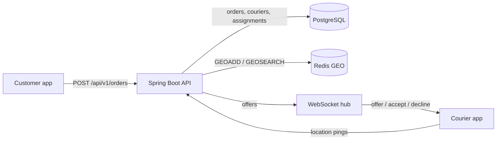

# Dispatch

[](https://github.com/vivekdavara/dispatch/actions/workflows/ci.yml)

A real-time order/courier matching backend: orders come in, the nearest available courier is chosen with a
priority rule, the offer is pushed over a WebSocket, and the order is reassigned on decline or timeout.
Java 21, Spring Boot 3.5, PostgreSQL (Flyway), Redis GEO, WebSockets.

> **Status: in progress (day 1 of 5).** The design, schema, assignment rule and health check are built and
> tested. Order intake, live courier locations and the assignment engine come next. See [DESIGN.md](DESIGN.md).

## Architecture



Postgres is the source of truth; Redis holds only live courier positions. Partial unique indexes in Postgres make
double assignment impossible even if two engine threads race.

## The assignment rule (built and tested)

- **Which order next:** `priority = tierBonus + minutesWaiting` (PRIORITY = +10 minutes), highest first, so
  standard orders can't starve. Code: [`PriorityScore`](src/main/java/io/github/vivekdavara/dispatch/domain/PriorityScore.java).
- **Which courier:** nearest available within 5 km by haversine distance; couriers within 50 m of the nearest are
  a tie, broken by longest idle time, then courier id. Code:
  [`CourierRanking`](src/main/java/io/github/vivekdavara/dispatch/domain/CourierRanking.java).

## Run it locally

Needs Java 21, Maven, the Homebrew Postgres 14 on port 5432, and `redis-server`.

```bash
./scripts/dev-up.sh
```

```bash
JAVA_HOME=/opt/homebrew/opt/openjdk@21 mvn test
```

```bash
JAVA_HOME=/opt/homebrew/opt/openjdk@21 mvn spring-boot:run
```

```bash
curl -s localhost:8101/api/v1/health
```

`/api/v1/health` returns 200 with each store's status and round-trip time, or 503 if Postgres or Redis is down.
Stop Redis with `./scripts/dev-down.sh`.

Configuration: the app uses `jdbc:postgresql://localhost:5432/dispatch` as your OS user and Redis on 6381.
Override with `SPRING_DATASOURCE_URL`, `SPRING_DATASOURCE_USERNAME`, `SPRING_DATASOURCE_PASSWORD` and
`SPRING_DATA_REDIS_PORT`; CI does this with service containers.

## Tests

| Suite | What it checks |
|---|---|
| `GeoPointTest`, `PriorityScoreTest`, `CourierRankingTest` | the assignment rule as pure functions |
| `SchemaTest` | Flyway V1 against real Postgres: constraints, idempotency key, one live assignment per order and per courier |
| `HealthControllerTest` | health logic with mocked stores, including both failure paths |
| `HealthEndpointsTest` | `/api/v1/health` and `/actuator/health` against real Postgres and Redis |

## Results

Measured results (assignment latency p50/p95 over 50K simulated events) arrive on day 4.

## License

MIT
