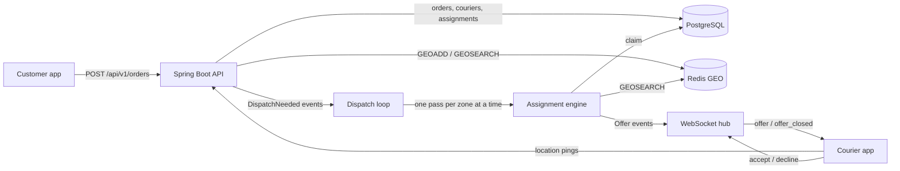

# Dispatch

[](https://github.com/vivekdavara/dispatch/actions/workflows/ci.yml)

A real-time order/courier matching backend: orders come in, the nearest available courier is chosen with a
priority rule, the offer is pushed over a WebSocket, and the order is reassigned on decline or timeout.
Java 21, Spring Boot 3.5, PostgreSQL (Flyway), Redis GEO, WebSockets.

> **Status: in progress (day 4 of 5).** Built and tested: the design, schema and assignment rule (day 1);
> idempotent order intake, live courier positions in Redis GEO and the assignment engine (day 2); offers pushed
> over a WebSocket, accept/decline, 30 s offer timeouts with reassignment, pickup and delivery, and an
> event-driven assignment loop (day 3); a 50K-event load simulator with measured assignment latency before and
> after one engine optimisation, and handling for courier disconnects and client retries (day 4). See
> [DESIGN.md](DESIGN.md).

## Architecture



Postgres is the source of truth; Redis holds only live courier positions. Partial unique indexes in Postgres make
double assignment impossible even if two engine threads race.

## The assignment rule (built and tested)

- **Which order next:** `priority = tierBonus + minutesWaiting` (PRIORITY = +10 minutes), highest first, so
  standard orders can't starve. Code: [`PriorityScore`](src/main/java/io/github/vivekdavara/dispatch/domain/PriorityScore.java).
- **Which courier:** nearest available within 5 km by haversine distance; couriers within 50 m of the nearest are
  a tie, broken by longest idle time, then courier id. Code:
  [`CourierRanking`](src/main/java/io/github/vivekdavara/dispatch/domain/CourierRanking.java).

## How an order gets a courier (day 2)

1. `POST /api/v1/orders` with an `Idempotency-Key`: 201 for a new order, 200 + `Idempotent-Replayed: true` for a
   retry, 409 if the key was used with a different body. Racing retries still create one order
   (`INSERT … ON CONFLICT DO NOTHING`, then replay the winner).
2. Couriers ping `PUT /api/v1/couriers/{id}/location` every few seconds: `GEOADD` into the zone's GEO set plus a
   60 s `courier:seen` marker, one pipelined round trip, no Postgres.
3. An engine pass ([`AssignmentEngine`](src/main/java/io/github/vivekdavara/dispatch/assignment/AssignmentEngine.java))
   reads the zone's free couriers once (since day 4), takes pending orders by priority, finds fresh couriers within
   5 km with `GEOSEARCH`, keeps the free ones that haven't turned the order down, ranks them, and claims the best
   one with compare-and-set updates in one transaction; it stops once every free courier has an offer. Eight passes
   racing on one zone never double-assign (`ConcurrentDispatchTest`).

## Offers, answers and the loop (day 3)

4. **Passes run themselves.** Order created, courier online, offer declined or expired, and delivery done each
   publish an event after their change commits; the
   [`DispatchLoop`](src/main/java/io/github/vivekdavara/dispatch/assignment/DispatchLoop.java) turns it into a
   pass. [`PassScheduler`](src/main/java/io/github/vivekdavara/dispatch/assignment/PassScheduler.java) runs at
   most one pass per zone at a time and coalesces bursts (1,000 orders during a pass cost one more pass) without
   losing a request. A 5 s sweep covers couriers driving into range, since pings don't trigger passes.
5. **The offer reaches the courier** on `ws://…/ws/couriers/{id}` as an `offer` message with pickup, drop-off,
   distance and `expiresAt`. A courier who reconnects mid-offer gets it again.
6. **The courier answers** with `{"type": "accept" | "decline", "assignmentId": …}` (or the same over HTTP).
   [`OfferService`](src/main/java/io/github/vivekdavara/dispatch/assignment/OfferService.java) settles it in one
   transaction where the assignment's `OFFERED →` compare-and-set decides any race between accept, decline and
   expiry. Decline or 30 s of silence returns the order to `PENDING`; it's re-offered at once, never to the same
   courier.
7. **Pickup and delivery** over HTTP; delivery frees the courier, which triggers the next pass.

## Disconnects and retries (day 4)

- **A courier's socket drops.** They have 10 s (`dispatch.sockets.reconnect-grace`) to reconnect, and get their
  open offer resent if they do. If they don't, an offer they hold goes straight to the next courier instead of
  waiting out its 30 s, and they go offline in the same transaction
  ([`OfferService.disconnected`](src/main/java/io/github/vivekdavara/dispatch/assignment/OfferService.java)). A
  courier mid-delivery is left alone.
- **A client retries.** An order POST retried with the same `Idempotency-Key` returns the original order, even
  when the retry races the original. An accept or decline retried after a dropped acknowledgement now gets the same
  answer back instead of a 409 (the simulator found that one: every retried answer was refused).
- **Offers carry the claim time.** An offer used to be stamped with the start of the engine pass that made it, so
  a slow pass quietly shortened the courier's 30 s answer window.

## Run it locally

Needs Java 21, Maven, the Homebrew Postgres 14 on port 5432, and `redis-server`.

```bash
./scripts/dev-up.sh
```

```bash
JAVA_HOME=/opt/homebrew/opt/openjdk@21 mvn test
```

```bash
JAVA_HOME=/opt/homebrew/opt/openjdk@21 mvn spring-boot:run
```

```bash
curl -s localhost:8101/api/v1/health
```

`/api/v1/health` returns 200 with each store's status and round-trip time, or 503 if Postgres or Redis is down.
To load-test it, `./scripts/simulate.sh <label>` starts its own copy of the app on port 8101 (stop yours first)
against a fresh `dispatch_sim` database and replays 50,000 events (about 6 minutes; see [Results](#results-day-4)).
Stop Redis with `./scripts/dev-down.sh`.

### Try it

With the app running, create a zone and a courier, put the courier online near the pickup, and create an order:

```bash
curl -s -X PUT localhost:8101/api/v1/zones/boston-back-bay -H 'Content-Type: application/json' -d '{"name": "Boston Back Bay", "centerLat": 42.35, "centerLng": -71.08, "radiusKm": 3}'
```

```bash
C=$(curl -s -X POST localhost:8101/api/v1/couriers -H 'Content-Type: application/json' -d '{"zoneId": "boston-back-bay", "name": "Ana"}' | python3 -c 'import sys, json; print(json.load(sys.stdin)["id"])')
```

```bash
curl -s -X PUT localhost:8101/api/v1/couriers/$C/status -H 'Content-Type: application/json' -d '{"status": "AVAILABLE"}'
```

```bash
curl -s -X PUT localhost:8101/api/v1/couriers/$C/location -H 'Content-Type: application/json' -d '{"lat": 42.352, "lng": -71.081}'
```

```bash
curl -s -i -X POST localhost:8101/api/v1/orders -H 'Content-Type: application/json' -H 'Idempotency-Key: demo-1' -d '{"zoneId": "boston-back-bay", "pickup": {"lat": 42.35, "lng": -71.08}, "dropoff": {"lat": 42.36, "lng": -71.06}, "tier": "PRIORITY"}'
```

No dispatch call is needed: creating the order triggers a pass, and the courier is offered the order. See it:

```bash
curl -s "localhost:8101/api/v1/couriers/$C"
```

The courier is now `OFFERED`. A courier app connected to `ws://localhost:8101/ws/couriers/$C` receives the offer
as JSON. In a hand run on 2026-10-08 (the jar, a Node 23 `WebSocket` client that posts the order after `hello`
and accepts the offer), the socket showed:

```
<- {"type":"hello","courierId":"e7f8…"}
<- {"type":"offer","assignmentId":1678,"orderId":"2583…","tier":"STANDARD","pickup":{"lat":42.35,"lng":-71.08},
    "dropoff":{"lat":42.36,"lng":-71.06},"distanceMeters":237.1,"offeredAt":"…07.941Z","expiresAt":"…37.941Z"}
<- {"type":"offer_closed","assignmentId":1678,"status":"ACCEPTED"}
<- {"type":"accepted","assignmentId":1678}
```

and, for a second order left unanswered, `{"type":"offer_closed","assignmentId":1679,"status":"EXPIRED"}` arrived
31.0 s after the order was posted (30 s timeout plus at most one 1 s expiry tick). Those are single hand-run
observations, not measurements; latency percentiles come from the day-4 simulator.

Without a socket, answer over HTTP (`A` is the `assignmentId`):

```bash
curl -s -X POST localhost:8101/api/v1/assignments/$A/accept -H 'Content-Type: application/json' -d "{\"courierId\": \"$C\"}"
```

then `/pickup` and `/deliver` the same way. Sending the order request again returns 200 with
`Idempotent-Replayed: true`; changing its body under the same key returns a 409 `application/problem+json`.
`POST /api/v1/zones/{id}/dispatch` still runs a pass by hand.

Configuration: the app uses `jdbc:postgresql://localhost:5432/dispatch` as your OS user and Redis on 6381.
Override with `SPRING_DATASOURCE_URL`, `SPRING_DATASOURCE_USERNAME`, `SPRING_DATASOURCE_PASSWORD` and
`SPRING_DATA_REDIS_PORT`; CI does this with service containers.

## Tests

227 tests (`JAVA_HOME=/opt/homebrew/opt/openjdk@21 mvn test`, about a minute, 25 s of it the simulator smoke
test); everything except the pure-function, scheduler, simulator-unit and mocked-health suites runs against real
Postgres and Redis. Most tests turn the event loop off (`src/test/resources/config/application.yml`) to drive the
engine by hand; the loop, socket, end-to-end and simulator suites turn it on in their own context.

| Suite | What it checks |
|---|---|
| `GeoPointTest`, `PriorityScoreTest`, `CourierRankingTest` | the assignment rule as pure functions |
| `SchemaTest` | Flyway V1 against real Postgres: constraints, idempotency key, one live assignment per order and per courier |
| `HealthControllerTest` | health logic with mocked stores, including both failure paths |
| `HealthEndpointsTest` | `/api/v1/health` and `/actuator/health` against real Postgres and Redis |
| `RequestHashTest`, `OrderServiceTest`, `OrderControllerTest` | idempotent order intake: replay, 409 on a changed body, 400/404/422 cases |
| `ConcurrentOrderCreationTest` | 16 simultaneous requests with one key create exactly one order (5 repetitions) |
| `CourierApiTest`, `CourierLiveApiTest`, `CourierLocationsTest` | registration, compare-and-set status changes, Redis GEO pings, freshness TTL and pruning |
| `AssignmentEngineTest` | nearest first, the 50 m idle-time tie-break, stale/offline/busy couriers skipped, 5 km limit, priority vs waiting time |
| `ConcurrentDispatchTest` | 8 engine passes racing on one zone: every courier and order in at most one offer (5 repetitions) |
| `ZoneApiTest` | zone upsert and the whole day-2 flow over HTTP |
| `OfferServiceTest` | accept, decline, expiry; decliners never re-offered that order; accept racing decline and accept racing expiry always have one winner (5 repetitions each); repeated answers are harmless; a disconnect releases the held offer and takes the courier offline in one step |
| `OfferTimestampTest` | with a clock that ticks on every read, two offers from one pass carry their own claim times |
| `CandidateSnapshotTest` | the snapshot pass makes exactly the per-order pass's offers on identical zones from eight seeds; no free courier means no orders examined; the pass stops when free couriers run out |
| `AssignmentApiTest` | accept → pickup → deliver over HTTP, and the 404/409 cases (deliver before pickup rolls back) |
| `PassSchedulerTest` | one pass per zone at a time, zones in parallel, bursts coalesce into one more pass, no request lost, a failing pass doesn't wedge the zone |
| `DispatchLoopTest` | with the loop on and no manual passes: new order, decline, timeout, courier online, sweep, delivery each lead to an offer |
| `CourierSocketTest` | real sockets: offer pushed, accept/decline over the wire, a retried accept acked twice, expiry seen on the wire, resend on reconnect, a drop past the grace hands the offer on and takes the courier offline, a reconnect cancels the grace (a second drop gets a full one), a busy courier is left alone, replace (4001), unknown courier (4004), bad messages |
| `DeliveryFlowTest` | one order from checkout to door through HTTP and the socket only |
| `LatencySummaryTest`, `ScenarioTest`, `RecorderTest`, `ReportTableTest` | the simulator's percentiles (nearest rank), its seeded scenarios (counts, determinism, zones, rush density, retry and drop shares), the latency join, and the results table |
| `SimulatorSmokeTest` | the simulator's 1,000-event scenario against the app: every order created once, offered and delivered; retries consistent; drops reconnected; the database agrees |

## Results (day 4)

Measured with the load simulator ([DESIGN.md, "Measurement"](DESIGN.md#measurement-d4-the-load-simulator)):
**50,000 synthetic events** (10,000 orders and 40,000 courier location pings) replayed in real time over 5 minutes
against the running jar, in 4 zones, one real WebSocket per courier, plus 40 injected socket drops. Orders arrive at
a steady rate with a 60 s rush at 3×. The data is synthetic, and the app, Postgres 14.20, Redis 8.8 and the
simulator all share one Apple M3 (8 cores, 16 GB, macOS 26.6, OpenJDK 21.0.12), so absolute numbers include their
contention; what's compared is the same seeded scenario on the same build with one property flipped. Every number
is from the `target/sim/<label>.json` the command next to it writes.

```bash
./scripts/simulate.sh standard-before --dispatch.assignment.candidate-snapshot=false
```

```bash
./scripts/simulate.sh standard-after --dispatch.assignment.candidate-snapshot=true
```

```bash
SIM_ARGS="--scenario overload" ./scripts/simulate.sh overload-before --dispatch.assignment.candidate-snapshot=false
```

```bash
SIM_ARGS="--scenario overload" ./scripts/simulate.sh overload-after --dispatch.assignment.candidate-snapshot=true
```

`standard` has 100 couriers per zone: the fleet has slack at the base rate and is about 20% short during the rush.
`overload` has 60 per zone, which the rush overloads about twice over. Each script run starts the app on an empty
`dispatch_sim` database.

### The optimisation: one courier snapshot per pass

The day-2 engine asked Postgres once per pending order which nearby couriers were free, and walked its whole
200-order batch even when nobody was. The snapshot pass reads the zone's free couriers once, filters in memory, and
stops when they're all taken (DESIGN.md, "One engine pass"). Two rounds, run in the order before, after, after,
before so drift can't favour either side: round 1 on build `f9d59e6` (labels without a suffix), round 2 on `94d15bf`
(suffix `-2`, which adds the priority-inversion count). The engine code is the same in both builds. The table is
printed by `./scripts/sim-table.sh target/sim/*.json`:

| Run | First offer p50 | p95 | p99 | max | Server-side p50 | Freed → next offer p50 | Mean pass | Orders examined per pass | Passes | Priority inversions |
|---|---|---|---|---|---|---|---|---|---|---|
| standard-before | 7.5 ms | 14.4 s | 26.8 s | 55.1 s | 3.9 ms | 445.2 ms | 15.7 ms | 20.3 | 16,979 | n/a |
| standard-before-2 | 8.4 ms | 14.5 s | 26.1 s | 65.9 s | 4.6 ms | 453.7 ms | 15.8 ms | 20.3 | 16,941 | 177,205 |
| standard-after | 7.6 ms | 13.6 s | 16.9 s | 20.4 s | 3.9 ms | 426.8 ms | 2.0 ms | 0.5 | 21,433 | n/a |
| standard-after-2 | 8.1 ms | 13.6 s | 16.8 s | 20.4 s | 4.3 ms | 426.5 ms | 2.1 ms | 0.5 | 21,447 | 56 |
| overload-before | 14.2 s | 72.4 s | 105.6 s | 166.7 s | 14.2 s | 2.3 ms | 51.1 ms | 86.9 | 13,724 | n/a |
| overload-before-2 | 13.9 s | 72.1 s | 104.7 s | 164.2 s | 13.9 s | 2.6 ms | 51.4 ms | 86.1 | 13,607 | 522,301 |
| overload-after | 18.4 s | 65.5 s | 72.2 s | 78.3 s | 18.4 s | 7.7 ms | 2.5 ms | 0.5 | 21,409 | n/a |
| overload-after-2 | 18.3 s | 65.7 s | 72.5 s | 80.1 s | 18.3 s | 7.8 ms | 2.5 ms | 0.6 | 21,365 | 82 |

- *First offer*: from just before the customer's POST is sent to the first offer for that order arriving on a
  courier's socket, n = 10,000 in every run. *Server-side*: the engine's own view from Postgres, `created_at` to
  the first `offered_at`; at the median the rest of the first-offer time is the HTTP request around the insert (two
  lookups first), the claim's commit, the socket push and the client.
- *Freed → next offer*: from a courier sending its delivery to its next offer. In overload there's always an order
  waiting, so it's the engine's reaction time; in standard it's mostly the courier waiting for demand.
- *Mean pass*, *orders examined per pass* and *passes* come from `/actuator/metrics`. *Priority inversions*: pairs of
  orders in one zone where A outranked B and was already waiting when B got its first offer, yet A's came later.

What the numbers say (the rounds agree closely: every percentile in seconds is within 3% across rounds except the
per-order pass's standard max, 55.1 vs 65.9 s, and the millisecond medians are within 1 ms):

- **Engine work dropped about 8× (standard) and 20× (overload).** Mean pass time went from 15.7 / 15.8 ms to
  2.0 / 2.1 ms and from 51.1 / 51.4 ms to 2.5 ms; a pass now looks at 0.5 orders on average instead of 20 or
  87, because most passes find no free courier and stop after one query.
- **With a courier free, latency didn't change**: first-offer p50 is 7.5 / 8.4 ms before and 7.6 / 8.1 ms after.
  The per-order query was a small part of a pass that only looked at one or two orders.
- **The tail got much shorter.** Standard: p99 26.8 / 26.1 s → 16.9 / 16.8 s and max 55.1 / 65.9 s → 20.4 s.
  Overload: p99 105.6 / 104.7 s → 72.2 / 72.5 s and max 166.7 / 164.2 s → 78.3 / 80.1 s. p95 moved less
  (14.4 → 13.6 s, 72.4 → 65.5 s).
- **But the overload median got worse** (14.2 / 13.9 s → 18.4 / 18.3 s), and the mean rose about 5% (23.0 s → 24.2 /
  24.3 s). The fleet delivers what it delivers (both passes finish the run in 337 s); what changed most is *who*
  waits. A long per-order pass looked couriers up live, so a courier who came free while the pass was on the 150th
  order went to the 150th order, ahead of the 149 that outranked it: 522,301 inverted pairs in overload and 177,205
  in standard. That let some newer orders jump the queue (a lower median) and left the oldest waiting minutes. The
  snapshot pass never sees a courier freed mid-pass; that courier's event starts the next pass, which serves the
  queue from the top, as the rule in DESIGN.md says it should: 82 and 56 inverted pairs. What's left comes from
  orders a pass couldn't see yet (created while it ran) or couldn't serve (every courier in range had refused it, or
  was over 5 km away); the simulator doesn't break them down yet, nor the 5% in the mean by tier. The same effect
  shows in *freed → next offer* in overload: 2.3 / 2.6 ms before (grabbed mid-pass by whatever order was current) vs
  7.7 / 7.8 ms after (the next pass's turnaround).

The 50 m tie band, the fairness tie-break and the claim logic are untouched; `CandidateSnapshotTest` checks the two
passes make identical offers whenever nothing changes mid-pass.

### Correctness under load (all eight runs)

- 10,000 orders created exactly once: 439 orders were POSTed twice with the same key, and all 439 retries got the
  original order back (`retriesConsistent`), with 0 duplicates.
- 10,000 offered, accepted and delivered; 0 HTTP, socket or delivery errors; 40,000 of 40,000 pings accepted.
- 518 to 582 answers per run were sent twice (a retry after a lost ack), and 0 were refused.
- 40 socket drops, 40 reconnects. The 20 couriers whose socket stayed down past the 10 s grace found themselves
  offline when they came back (`foundOfflineOnReconnect` = 20); none of the 20 short drops cost a courier their
  status. Assignments ended 10,000 `COMPLETED`, about 1,080 `DECLINED` (the bots decline 10%) and 16 to 20
  `EXPIRED` (offers to couriers whose socket was down: released at the end of the grace, or timed out).

### Limits of these numbers

Two runs per configuration, one machine, synthetic load with made-up courier behaviour (the bots deliver in seconds,
not minutes). The latency in both scenarios is mostly queueing for a free courier during the rush, which no engine
change can remove; the engine's own share is the 3.9 to 4.6 ms server-side p50. The scenarios don't exercise
multiple app instances, real road distances, or a slow network.

## License

MIT
