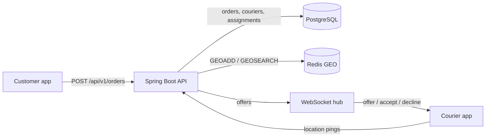

# Dispatch

[](https://github.com/vivekdavara/dispatch/actions/workflows/ci.yml)

A real-time order/courier matching backend: orders come in, the nearest available courier is chosen with a
priority rule, the offer is pushed over a WebSocket, and the order is reassigned on decline or timeout.
Java 21, Spring Boot 3.5, PostgreSQL (Flyway), Redis GEO, WebSockets.

> **Status: in progress (day 2 of 5).** Built and tested: the design, schema and assignment rule (day 1);
> idempotent order intake, live courier positions in Redis GEO and the assignment engine (day 2). WebSocket offers,
> accept/decline and timeouts come next. See [DESIGN.md](DESIGN.md).

## Architecture



Postgres is the source of truth; Redis holds only live courier positions. Partial unique indexes in Postgres make
double assignment impossible even if two engine threads race.

## The assignment rule (built and tested)

- **Which order next:** `priority = tierBonus + minutesWaiting` (PRIORITY = +10 minutes), highest first, so
  standard orders can't starve. Code: [`PriorityScore`](src/main/java/io/github/vivekdavara/dispatch/domain/PriorityScore.java).
- **Which courier:** nearest available within 5 km by haversine distance; couriers within 50 m of the nearest are
  a tie, broken by longest idle time, then courier id. Code:
  [`CourierRanking`](src/main/java/io/github/vivekdavara/dispatch/domain/CourierRanking.java).

## How an order gets a courier (day 2)

1. `POST /api/v1/orders` with an `Idempotency-Key`: 201 for a new order, 200 + `Idempotent-Replayed: true` for a
   retry, 409 if the key was used with a different body. Racing retries still create one order
   (`INSERT … ON CONFLICT DO NOTHING`, then replay the winner).
2. Couriers ping `PUT /api/v1/couriers/{id}/location` every few seconds: `GEOADD` into the zone's GEO set plus a
   60 s `courier:seen` marker, one pipelined round trip, no Postgres.
3. An engine pass ([`AssignmentEngine`](src/main/java/io/github/vivekdavara/dispatch/assignment/AssignmentEngine.java))
   takes pending orders by priority, finds fresh couriers within 5 km with `GEOSEARCH`, keeps the `AVAILABLE` ones,
   ranks them, and claims the best one with compare-and-set updates in one transaction. Eight passes racing on one
   zone never double-assign (`ConcurrentDispatchTest`). Today a pass runs on `POST /api/v1/zones/{id}/dispatch`;
   day 3 makes it event-driven.

## Run it locally

Needs Java 21, Maven, the Homebrew Postgres 14 on port 5432, and `redis-server`.

```bash
./scripts/dev-up.sh
```

```bash
JAVA_HOME=/opt/homebrew/opt/openjdk@21 mvn test
```

```bash
JAVA_HOME=/opt/homebrew/opt/openjdk@21 mvn spring-boot:run
```

```bash
curl -s localhost:8101/api/v1/health
```

`/api/v1/health` returns 200 with each store's status and round-trip time, or 503 if Postgres or Redis is down.
Stop Redis with `./scripts/dev-down.sh`.

### Try the day-2 flow

With the app running, create a zone and a courier, put the courier online near the pickup, and create an order:

```bash
curl -s -X PUT localhost:8101/api/v1/zones/boston-back-bay -H 'Content-Type: application/json' -d '{"name": "Boston Back Bay", "centerLat": 42.35, "centerLng": -71.08, "radiusKm": 3}'
```

```bash
C=$(curl -s -X POST localhost:8101/api/v1/couriers -H 'Content-Type: application/json' -d '{"zoneId": "boston-back-bay", "name": "Ana"}' | python3 -c 'import sys, json; print(json.load(sys.stdin)["id"])')
```

```bash
curl -s -X PUT localhost:8101/api/v1/couriers/$C/status -H 'Content-Type: application/json' -d '{"status": "AVAILABLE"}'
```

```bash
curl -s -X PUT localhost:8101/api/v1/couriers/$C/location -H 'Content-Type: application/json' -d '{"lat": 42.352, "lng": -71.081}'
```

```bash
curl -s -i -X POST localhost:8101/api/v1/orders -H 'Content-Type: application/json' -H 'Idempotency-Key: demo-1' -d '{"zoneId": "boston-back-bay", "pickup": {"lat": 42.35, "lng": -71.08}, "dropoff": {"lat": 42.36, "lng": -71.06}, "tier": "PRIORITY"}'
```

```bash
curl -s -X POST localhost:8101/api/v1/zones/boston-back-bay/dispatch
```

The dispatch call returns the offer, e.g. `{"zoneId":"boston-back-bay","offers":[{"assignmentId":323,
"orderId":"ef0e…","courierId":"a8a7…","distanceMeters":237.1,…}]}` (from a run on 2026-10-07; the courier is
237 m from the pickup). Sending the order request again returns 200 with `Idempotent-Replayed: true`; changing
its body under the same key returns a 409 `application/problem+json`.

Configuration: the app uses `jdbc:postgresql://localhost:5432/dispatch` as your OS user and Redis on 6381.
Override with `SPRING_DATASOURCE_URL`, `SPRING_DATASOURCE_USERNAME`, `SPRING_DATASOURCE_PASSWORD` and
`SPRING_DATA_REDIS_PORT`; CI does this with service containers.

## Tests

114 tests (`JAVA_HOME=/opt/homebrew/opt/openjdk@21 mvn test`); everything except the pure-function and
mocked-health suites runs against real Postgres and Redis.

| Suite | What it checks |
|---|---|
| `GeoPointTest`, `PriorityScoreTest`, `CourierRankingTest` | the assignment rule as pure functions |
| `SchemaTest` | Flyway V1 against real Postgres: constraints, idempotency key, one live assignment per order and per courier |
| `HealthControllerTest` | health logic with mocked stores, including both failure paths |
| `HealthEndpointsTest` | `/api/v1/health` and `/actuator/health` against real Postgres and Redis |
| `RequestHashTest`, `OrderServiceTest`, `OrderControllerTest` | idempotent order intake: replay, 409 on a changed body, 400/404/422 cases |
| `ConcurrentOrderCreationTest` | 16 simultaneous requests with one key create exactly one order (5 repetitions) |
| `CourierApiTest`, `CourierLiveApiTest`, `CourierLocationsTest` | registration, compare-and-set status changes, Redis GEO pings, freshness TTL and pruning |
| `AssignmentEngineTest` | nearest first, the 50 m idle-time tie-break, stale/offline/busy couriers skipped, 5 km limit, priority vs waiting time |
| `ConcurrentDispatchTest` | 8 engine passes racing on one zone: every courier and order in at most one offer (5 repetitions) |
| `ZoneApiTest` | zone upsert and the whole day-2 flow over HTTP |

## Results

Measured results (assignment latency p50/p95 over 50K simulated events) arrive on day 4.

## License

MIT
