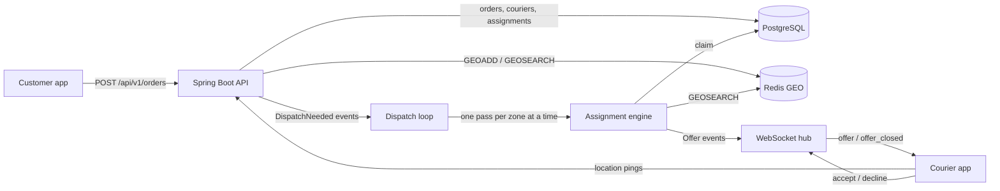

# Dispatch

[](https://github.com/vivekdavara/dispatch/actions/workflows/ci.yml)

A real-time order/courier matching backend: orders come in, the nearest available courier is chosen with a
priority rule, the offer is pushed over a WebSocket, and the order is reassigned on decline or timeout.
Java 21, Spring Boot 3.5, PostgreSQL (Flyway), Redis GEO, WebSockets.

> **Status: in progress (day 3 of 5).** Built and tested: the design, schema and assignment rule (day 1);
> idempotent order intake, live courier positions in Redis GEO and the assignment engine (day 2); offers pushed
> over a WebSocket, accept/decline, 30 s offer timeouts with reassignment, pickup and delivery, and an
> event-driven assignment loop (day 3). The 50K-event simulator and latency numbers come next. See
> [DESIGN.md](DESIGN.md).

## Architecture



Postgres is the source of truth; Redis holds only live courier positions. Partial unique indexes in Postgres make
double assignment impossible even if two engine threads race.

## The assignment rule (built and tested)

- **Which order next:** `priority = tierBonus + minutesWaiting` (PRIORITY = +10 minutes), highest first, so
  standard orders can't starve. Code: [`PriorityScore`](src/main/java/io/github/vivekdavara/dispatch/domain/PriorityScore.java).
- **Which courier:** nearest available within 5 km by haversine distance; couriers within 50 m of the nearest are
  a tie, broken by longest idle time, then courier id. Code:
  [`CourierRanking`](src/main/java/io/github/vivekdavara/dispatch/domain/CourierRanking.java).

## How an order gets a courier (day 2)

1. `POST /api/v1/orders` with an `Idempotency-Key`: 201 for a new order, 200 + `Idempotent-Replayed: true` for a
   retry, 409 if the key was used with a different body. Racing retries still create one order
   (`INSERT … ON CONFLICT DO NOTHING`, then replay the winner).
2. Couriers ping `PUT /api/v1/couriers/{id}/location` every few seconds: `GEOADD` into the zone's GEO set plus a
   60 s `courier:seen` marker, one pipelined round trip, no Postgres.
3. An engine pass ([`AssignmentEngine`](src/main/java/io/github/vivekdavara/dispatch/assignment/AssignmentEngine.java))
   takes pending orders by priority, finds fresh couriers within 5 km with `GEOSEARCH`, keeps the `AVAILABLE` ones,
   ranks them, and claims the best one with compare-and-set updates in one transaction. Eight passes racing on one
   zone never double-assign (`ConcurrentDispatchTest`).

## Offers, answers and the loop (day 3)

4. **Passes run themselves.** Order created, courier online, offer declined or expired, and delivery done each
   publish an event after their change commits; the
   [`DispatchLoop`](src/main/java/io/github/vivekdavara/dispatch/assignment/DispatchLoop.java) turns it into a
   pass. [`PassScheduler`](src/main/java/io/github/vivekdavara/dispatch/assignment/PassScheduler.java) runs at
   most one pass per zone at a time and coalesces bursts (1,000 orders during a pass cost one more pass) without
   losing a request. A 5 s sweep covers couriers driving into range, since pings don't trigger passes.
5. **The offer reaches the courier** on `ws://…/ws/couriers/{id}` as an `offer` message with pickup, drop-off,
   distance and `expiresAt`. A courier who reconnects mid-offer gets it again.
6. **The courier answers** with `{"type": "accept" | "decline", "assignmentId": …}` (or the same over HTTP).
   [`OfferService`](src/main/java/io/github/vivekdavara/dispatch/assignment/OfferService.java) settles it in one
   transaction where the assignment's `OFFERED →` compare-and-set decides any race between accept, decline and
   expiry. Decline or 30 s of silence returns the order to `PENDING`; it's re-offered at once, never to the same
   courier.
7. **Pickup and delivery** over HTTP; delivery frees the courier, which triggers the next pass.

## Run it locally

Needs Java 21, Maven, the Homebrew Postgres 14 on port 5432, and `redis-server`.

```bash
./scripts/dev-up.sh
```

```bash
JAVA_HOME=/opt/homebrew/opt/openjdk@21 mvn test
```

```bash
JAVA_HOME=/opt/homebrew/opt/openjdk@21 mvn spring-boot:run
```

```bash
curl -s localhost:8101/api/v1/health
```

`/api/v1/health` returns 200 with each store's status and round-trip time, or 503 if Postgres or Redis is down.
Stop Redis with `./scripts/dev-down.sh`.

### Try it

With the app running, create a zone and a courier, put the courier online near the pickup, and create an order:

```bash
curl -s -X PUT localhost:8101/api/v1/zones/boston-back-bay -H 'Content-Type: application/json' -d '{"name": "Boston Back Bay", "centerLat": 42.35, "centerLng": -71.08, "radiusKm": 3}'
```

```bash
C=$(curl -s -X POST localhost:8101/api/v1/couriers -H 'Content-Type: application/json' -d '{"zoneId": "boston-back-bay", "name": "Ana"}' | python3 -c 'import sys, json; print(json.load(sys.stdin)["id"])')
```

```bash
curl -s -X PUT localhost:8101/api/v1/couriers/$C/status -H 'Content-Type: application/json' -d '{"status": "AVAILABLE"}'
```

```bash
curl -s -X PUT localhost:8101/api/v1/couriers/$C/location -H 'Content-Type: application/json' -d '{"lat": 42.352, "lng": -71.081}'
```

```bash
curl -s -i -X POST localhost:8101/api/v1/orders -H 'Content-Type: application/json' -H 'Idempotency-Key: demo-1' -d '{"zoneId": "boston-back-bay", "pickup": {"lat": 42.35, "lng": -71.08}, "dropoff": {"lat": 42.36, "lng": -71.06}, "tier": "PRIORITY"}'
```

No dispatch call is needed: creating the order triggers a pass, and the courier is offered the order. See it:

```bash
curl -s "localhost:8101/api/v1/couriers/$C"
```

The courier is now `OFFERED`. A courier app connected to `ws://localhost:8101/ws/couriers/$C` receives the offer
as JSON. In a hand run on 2026-10-08 (the jar, a Node 23 `WebSocket` client that posts the order after `hello`
and accepts the offer), the socket showed:

```
<- {"type":"hello","courierId":"e7f8…"}
<- {"type":"offer","assignmentId":1678,"orderId":"2583…","tier":"STANDARD","pickup":{"lat":42.35,"lng":-71.08},
    "dropoff":{"lat":42.36,"lng":-71.06},"distanceMeters":237.1,"offeredAt":"…07.941Z","expiresAt":"…37.941Z"}
<- {"type":"offer_closed","assignmentId":1678,"status":"ACCEPTED"}
<- {"type":"accepted","assignmentId":1678}
```

and, for a second order left unanswered, `{"type":"offer_closed","assignmentId":1679,"status":"EXPIRED"}` arrived
31.0 s after the order was posted (30 s timeout plus at most one 1 s expiry tick). Those are single hand-run
observations, not measurements; latency percentiles come from the day-4 simulator.

Without a socket, answer over HTTP (`A` is the `assignmentId`):

```bash
curl -s -X POST localhost:8101/api/v1/assignments/$A/accept -H 'Content-Type: application/json' -d "{\"courierId\": \"$C\"}"
```

then `/pickup` and `/deliver` the same way. Sending the order request again returns 200 with
`Idempotent-Replayed: true`; changing its body under the same key returns a 409 `application/problem+json`.
`POST /api/v1/zones/{id}/dispatch` still runs a pass by hand.

Configuration: the app uses `jdbc:postgresql://localhost:5432/dispatch` as your OS user and Redis on 6381.
Override with `SPRING_DATASOURCE_URL`, `SPRING_DATASOURCE_USERNAME`, `SPRING_DATASOURCE_PASSWORD` and
`SPRING_DATA_REDIS_PORT`; CI does this with service containers.

## Tests

173 tests (`JAVA_HOME=/opt/homebrew/opt/openjdk@21 mvn test`); everything except the pure-function,
scheduler and mocked-health suites runs against real Postgres and Redis. Most tests turn the event loop off
(`src/test/resources/config/application.yml`) to drive the engine by hand; the loop, socket and end-to-end suites
turn it on in their own context.

| Suite | What it checks |
|---|---|
| `GeoPointTest`, `PriorityScoreTest`, `CourierRankingTest` | the assignment rule as pure functions |
| `SchemaTest` | Flyway V1 against real Postgres: constraints, idempotency key, one live assignment per order and per courier |
| `HealthControllerTest` | health logic with mocked stores, including both failure paths |
| `HealthEndpointsTest` | `/api/v1/health` and `/actuator/health` against real Postgres and Redis |
| `RequestHashTest`, `OrderServiceTest`, `OrderControllerTest` | idempotent order intake: replay, 409 on a changed body, 400/404/422 cases |
| `ConcurrentOrderCreationTest` | 16 simultaneous requests with one key create exactly one order (5 repetitions) |
| `CourierApiTest`, `CourierLiveApiTest`, `CourierLocationsTest` | registration, compare-and-set status changes, Redis GEO pings, freshness TTL and pruning |
| `AssignmentEngineTest` | nearest first, the 50 m idle-time tie-break, stale/offline/busy couriers skipped, 5 km limit, priority vs waiting time |
| `ConcurrentDispatchTest` | 8 engine passes racing on one zone: every courier and order in at most one offer (5 repetitions) |
| `ZoneApiTest` | zone upsert and the whole day-2 flow over HTTP |
| `OfferServiceTest` | accept, decline, expiry; decliners never re-offered that order; accept racing decline and accept racing expiry always have one winner (5 repetitions each) |
| `AssignmentApiTest` | accept → pickup → deliver over HTTP, and the 404/409 cases (deliver before pickup rolls back) |
| `PassSchedulerTest` | one pass per zone at a time, zones in parallel, bursts coalesce into one more pass, no request lost, a failing pass doesn't wedge the zone |
| `DispatchLoopTest` | with the loop on and no manual passes: new order, decline, timeout, courier online, sweep, delivery each lead to an offer |
| `CourierSocketTest` | real sockets: offer pushed, accept/decline over the wire, expiry seen on the wire, resend on reconnect, replace (4001), unknown courier (4004), bad messages |
| `DeliveryFlowTest` | one order from checkout to door through HTTP and the socket only |

## Results

Measured results (assignment latency p50/p95 over 50K simulated events) arrive on day 4.

## License

MIT
